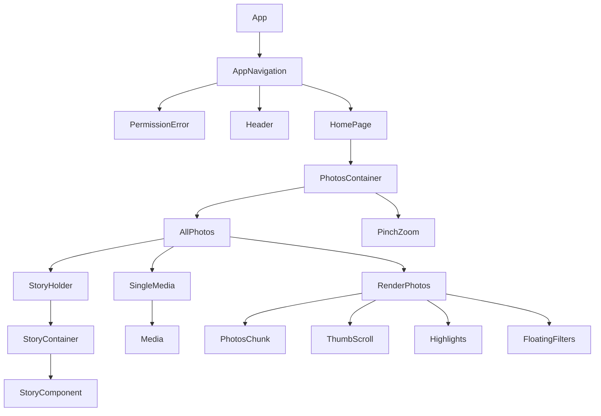

A user interface for the [Earth Change Operating System](https://docs.google.com/document/d/1yhxEirl_7Y4L6e8Q6CM9E1-aCDov1hn2IRerCEkrzk0/) stored on [Square](https://github.com/earthChange/Square).

## Installation
- [Install npm, git and expo-cli](#Installing-Pre-requisites)
- [Clone the project](#clone-the-project)
- [Install requirements](#install-requirements)
- [Run](#run)
- [Packages](#packages)
- [Pages structure](#pages-structure)
- [Components structure](#components-structure)
- [Components description](#components-descripction)

### Installing Pre-requisites

- NodeJS/NPM

This application needs NodeJs to run. You can download and install NodeJs from
the below link on any platform if you do not have it already.
[Download NodeJS](https://nodejs.org/en/)

you can also check if you already have NodeJs installed by running the following
two commands in terminal window

```
node -v
npm -v
```

- Git: You can use git to easily download the files from github into your
  computer (or if you prefer you can download files manually from this github
  repository in step 1 of cloning the application)
  [Download Git-Scm](https://git-scm.com/downloads)

you can also check whether you already have NodeJs installed by running the
following command in terminal window

```
git --version
```

Now you need to install expo-cli. If you want to know more about expo check
their website. [Expo](https://docs.expo.io/)

```
npm install --global expo-cli
```

Optional: if you prefer yarn you can install yarn.

```
npm install --global yarn
```

## Clone the project

You can clone the project by running the command below to your terminal:

for https cloning:

```bash
git clone https://github.com/earthChange/Land-Plan
```

```bash
cd photos
```

## Install requirements

You can install dependencies with `yarn` by running:

```bash
yarn
```

## Run

Then you can start the debug server using the command below:

```bash
yarn run start
```

At last but not least, for installing the debug version and starting the
development process on the emulator or a real device you should run commands
below: <br>

#### IOS

```
yarn run ios
```

#### Android

```
yarn run android
```

## Packages

- We used **expo Media Library** for getting the data from user's phone.
- We used a modified version of **expo-video-player** to play videos. It is
  available in our repo.
- We used a modified version of **react-native-stories-view** for the story
  style view on top of gallery, which is available in our repo.
- We used **RecyclerListView** from FlipKart, as the scrollView for the photos.
- We used **react-native-reanimated** for animations.
- We used **Recoil** for state management.
- We used **react-native-gesture-handler** for gesture handling.
- We used **@react-navigation/bottom-tabs** and **@react-navigation/native** for
  navigation.

## Pages structure

For now we have two pages in the app:

- The HomePage that is the main page for showing the media files.
- The PermissionError page that is the page we show when there is permission
  error from user's phone.
- We are working on creating the "Library" and "Search" pages.

## Components structure

```├── app.json
├── App.tsx
├── babel.config.js
├── components
│   ├── AllPhotos.tsx
│   ├── FloatingFilters.tsx
│   ├── Header.tsx
│   ├── Highlights.tsx
│   ├── Media.tsx
│   ├── PhotosChunk.tsx
│   ├── PhotosContainer.tsx
│   ├── PinchZoom.tsx
│   ├── RenderPhotos.tsx
│   ├── SingleMedia.tsx
│   ├── StoryHolder.tsx
│   └── ThumbScroll.tsx
├── index.js

├── metro.config.js
├── navigation
│   └── AppNavigation.tsx
├── package.json
├── package-lock.json
├── pages
│   ├── HomePage.tsx
│   └── PermissionError.tsx
├── store
│   ├── actions.ts
│   ├── reducer.ts
│   └── store.ts
├── __tests__
│   └── App-test.tsx
├── tsconfig.json
├── types
│   └── interfaces.ts
└── utils
    ├── APICalls.ts
    ├── constants.ts
    ├── functions.ts
    ├── LayoutUtil.ts
    └── permissions.ts

```

## Components description

The components are as what follows:

### PhotosContainer

**Purpose:** this component is responsible for getting the photos and videos
from storage and feed the AllPhotos component with storage photos.

- this component include the PinchZoom component and AllPhotos component

### PinchZoom

**Purpose:** This component is responsible for all the animations for switching
between different column modes, and actions we want to do when animations done.

- This component is wrapped around the AllPhotos component.
- The component uses GestureHandlers to respond to pinch and pan gestures

### AllPhotos

**Purpose:** This component is wrapped the three RenderPhotos components and is
responsible for lazy load the photos and feed the render photos with proper
data.

- The three different kind of RenderPhotos is the month view with 4 columns of
  photos, the day view with 3 columns of photos and the day view with 2 columns
  of photos.

### RenderPhotos

**Purpose:** This component includes with the number of PhotosChunk components
and one FlatList that wrapped all the PhotosChunk components that we want to
show the user. It is responsible to show the Photos(main) page of hte
application.

- This component also renders date headers.
- It uses RecyclerListView to show the scrollable grid of photos

### PhotosChunk:

**Purpose:** This component is responsible to show each block/Thumbnails in the
gallery.

### FloatingFilters:

**Purpose:** This component is responsible to show and position the "year"
titles when fingers are placed on thumb scroll.

### Header:

**Purpose:** This component is responsible to show the top header of the
application. It is used in the top Navigationbar.

### Highlights:

**Purpose:** This component is responsible to show the story thumbnails and text
on top of Photos page.

### Media:

**Purpose:** This component is responsible to display photo or video when opened
in full page. It is the component used in SingleMedia.

### SingleMedia:

**Purpose:** This component is responsible to show modal with the content when
image or video is opened in full page. It uses Media to show the photo or video.

### StoryHolder:

**Purpose:** This component is responsible to show each story/highlight in full
screen when thumbnail is clicked on.

### ThumbScroll:

**Purpose:** This component is responsible to show the thumb scroll icon in the
right of screen when scrolling.

## Components diagram



## How to contribute?

[Discussion here](https://github.com/earthChange/Land-Plan/discussions)

## Road map

- [x] Pinch/zoom to switch between 3 modes
- [x] Open each image/video in a Single image modal and scroll between images
- [x] Show highlights
- [x] Fast scroll/thumb scroll
- [x] Select and unselect each image to delete/edit/share
- [x] Connect with Dfinity
- [x] Auto-upload photos to backend
- [x] Automatic Migration tool from Google Photos
- [x] Connect with BOX (as a self-owned IPFS solution)
- [ ] Connect with Filecoin
- [ ] Connect with AWS
- [ ] Search page to search by date/tags
- [ ] Library page to show images by folder/Album
- [ ] AI features to do on-device analysis for face recognition/object
      recognition
